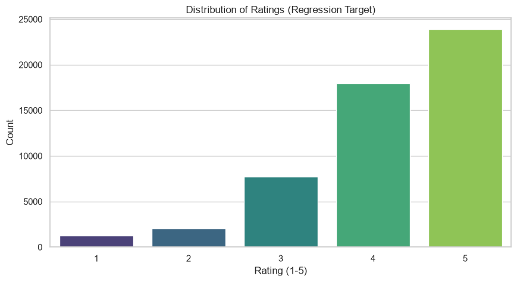
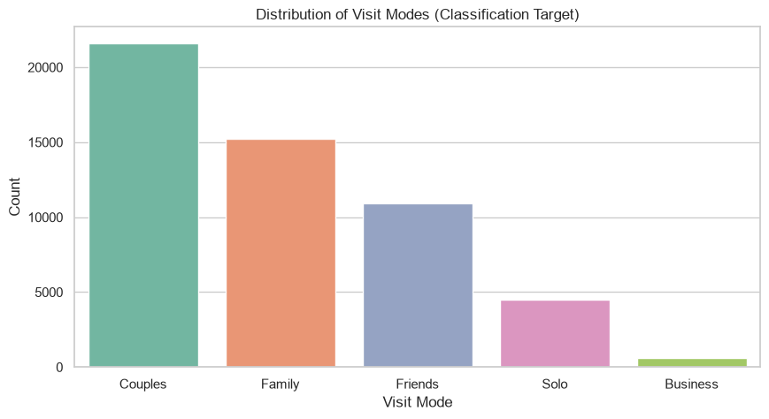
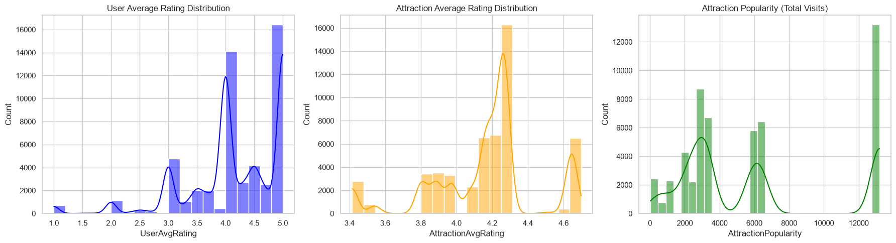
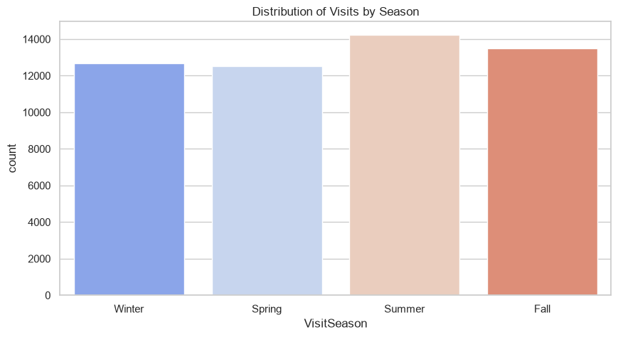
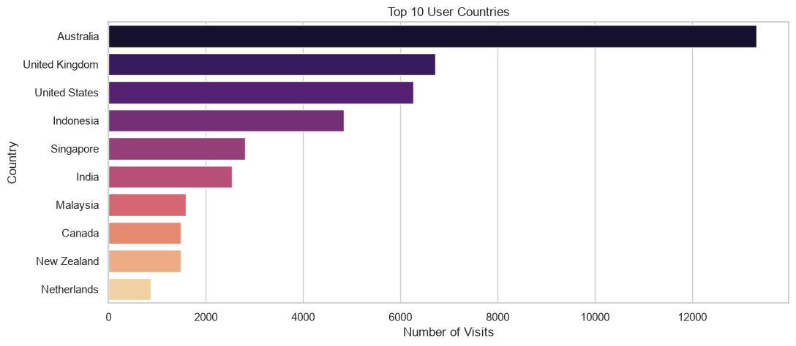
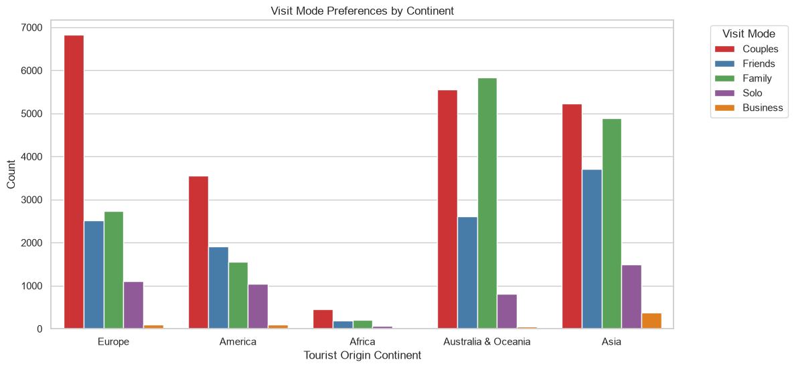
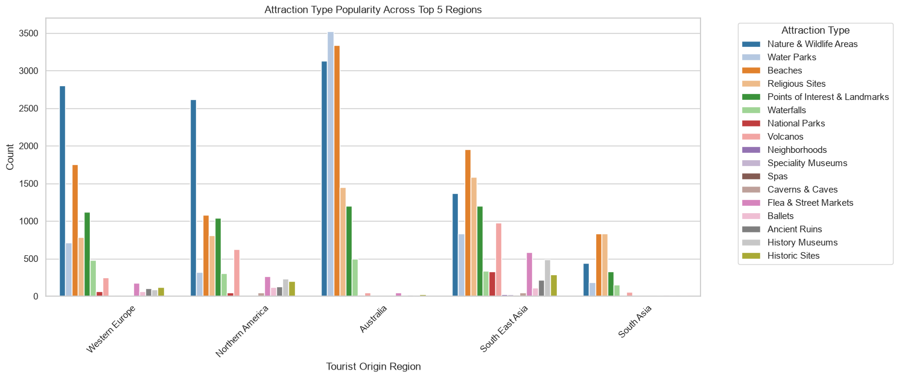
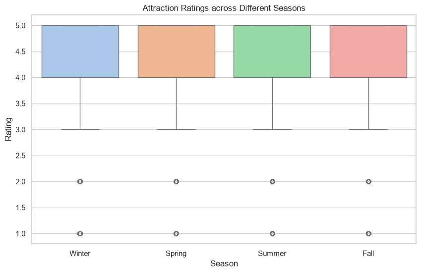
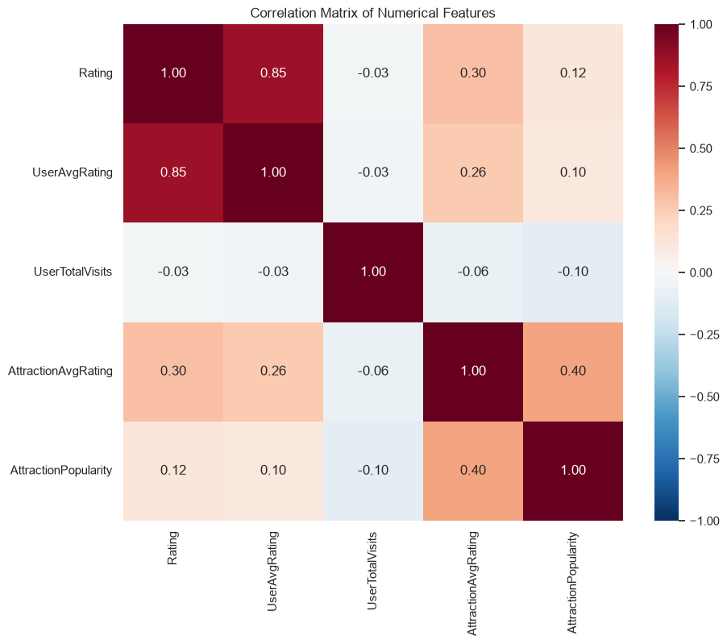

# Tourism Experience Analytics: Project Documentation

This document serves as the comprehensive log of actions, methodologies, and results for the *Tourism Experience Analytics Classification, Prediction, and Recommendation System*. It is updated dynamically as the project progresses through its predefined phases.

---

## Phase 1: Data Consolidation & Pipeline Setup

### Step 1.1: Project Initialization
*   **Action:** Established the foundational architecture for the project. 
*   **Implementation:** 
    *   Initialized a local Git repository and connected it to a remote GitHub repository.
    *   Created a Python virtual environment (`venv`).
    *   Generated the folder structure (`src/`, `notebooks/`, `processed_data/`, `models/`, `app/components/`).
    *   Created a `.gitignore` to exclude large datasets and environment files.
    *   Created `requirements.txt` containing dependencies like `pandas`, `scikit-learn`, `xgboost`, and `streamlit`.
    *   Developed a centralized `config.yaml` to securely manage all file paths without hardcoding them in scripts.

### Step 1.2: Data Loader Module
*   **Action:** Built a scalable method to ingest the raw relational data.
*   **Implementation:** Created the `DataIngestor` class in `src/data_ingestion.py`. It utilizes Python's `logging` module and dynamically reads the 9 raw `.xlsx` files based on paths provided in `config.yaml`.
*   **Results:** Successfully loaded all 9 datasets into a dictionary of pandas DataFrames without memory exhaustion.

### Step 1.3: Relational Merging Logic
*   **Action:** Flattened the highly normalized SQL-style tables into an Analytical Base Table (Feature Store) for Machine Learning.
*   **Implementation:** Developed the `merge_datasets` method in `DataIngestor`. 
    *   Enriched `User` data by resolving `ContinentId`, `RegionId`, `CountryId`, and `CityId` to their respective string names.
    *   Enriched `Item` data by resolving `AttractionTypeId` and `AttractionCityId`.
    *   Joined the enriched User and Item metadata directly onto the core `Transaction` dataset.
    *   Mapped numerical `VisitMode` IDs to their literal string equivalents (e.g., Business, Family).

### Step 1.4: Pipeline Execution
*   **Action:** Executed the data pipeline script.
*   **Results:** The final denormalized feature store (`raw_merged.csv`) was generated, containing exactly **52,930 rows and 23 columns**. The data was structurally sound and maintained a minimal memory footprint of ~15.5 MB.

---

## Phase 2: Data Understanding, Cleaning & Feature Engineering

### Step 2.1: Data Understanding & Profiling
*   **Action:** Profiled the `raw_merged.csv` dataset to inform cleaning strategies.
*   **Implementation:** Developed `notebooks/01_Data_Understanding.ipynb` for visual/statistical analysis and ran background validation scripts.
*   **Results & Insights:**
    *   **Duplicates:** 0 exact duplicate rows found.
    *   **Outliers:** None detected in target variables. `Rating` is strictly bounded between 1 and 5. `VisitYear` is strictly between 2013 and 2022.
    *   **Missing Values:** Detected only 8 missing records specifically in the `CityId`/`UserCity` columns (accounting for a negligible 0.015% of the data).
    *   **Cardinality Check:** Confirmed 153 unique User Countries (compared to 164 in the master Country lookup table, indicating 11 countries have no tourist records). Confirmed 5 distinct `VisitModeName` classes.

### Step 2.2: Data Cleaning Module
*   **Action:** Implemented automated data cleaning based on profiling insights.
*   **Implementation:** Created the `DataPreprocessor` class inside `src/preprocessing.py`.
    *   Added logic to strip leading/trailing whitespaces from all text columns to prevent categorical mismatches.
    *   Added a safety duplicate-drop function.
    *   Dropped the 8 records containing missing City data to prevent model hallucination.
*   **Results:** Dataset reduced from 52,930 rows to a perfectly clean **52,922 rows**.

### Step 2.3: Feature Engineering
*   **Action:** Extracted new, highly predictive columns from the existing data to improve machine learning accuracy.
*   **Implementation:** Added the `engineer_features` method to the `DataPreprocessor`. Created 5 new aggregated columns:
    1.  **`VisitSeason`**:
        *   *Logic Used:* Mapped the `VisitMonth` integer to categorical seasons (e.g., Dec-Feb = Winter, Jun-Aug = Summer).
        *   *Significance:* Captures seasonal trends. Tourist behaviors and modes change based on the weather (e.g., Families travel more during Summer holidays), making it a strong predictor for Visit Mode classification.
    2.  **`UserAvgRating`**:
        *   *Logic Used:* Grouped by `UserId` and calculated the mathematical mean of their `Rating` column.
        *   *Significance:* Establishes a "User Baseline" for strictness. Generous raters average higher scores than strict critics, allowing the Regression model to adjust predictions to the user's personal baseline.
    3.  **`UserTotalVisits`**:
        *   *Logic Used:* Grouped by `UserId` and counted the total number of `AttractionId` records.
        *   *Significance:* Acts as a proxy for "Traveler Experience." Frequent travelers might seek out different types of attractions or travel more for Business compared to casual one-time tourists.
    4.  **`AttractionAvgRating`**:
        *   *Logic Used:* Grouped by `AttractionId` and calculated the mean `Rating` received.
        *   *Significance:* Establishes a baseline "Quality Score" for the attraction. Universally loved places are highly likely to receive high future ratings, making this crucial for the Regression model.
    5.  **`AttractionPopularity`**:
        *   *Logic Used:* Grouped by `AttractionId` and counted the total number of `UserId` visits.
        *   *Significance:* Measures the "Hype" or "Crowdedness." Highly popular places attract different visit modes (like large Families) compared to niche, low-popularity places, aiding both Classification and Recommendation.
*   **Results:** The dataset expanded to **28 columns**. The fully cleaned and engineered dataset was permanently saved to disk as `processed_data/primary_cleaned_dataset.csv`.

### Step 2.4 & 2.5: Encoding, Scaling, & Finalizing Feature Store
*   **Action:** Transformed the dataset into a purely numerical matrix required for Machine Learning model ingestion.
*   **Implementation:** Added the `encode_and_scale` method to the `DataPreprocessor`.
    *   *Encoding:* Applied `LabelEncoder` to all categorical string features (e.g., `UserCity`, `Attraction`, `VisitSeason`). Label Encoding was chosen over One-Hot Encoding to prevent massive dimensionality expansion (e.g., preventing the 5,500+ unique cities from creating 5,500+ new columns).
    *   *Scaling:* Applied `StandardScaler` to all 14 numerical features (excluding target variables and IDs). This ensures features like `AttractionPopularity` (in the thousands) don't dominate features like `UserAvgRating` (1 to 5) simply due to magnitude.
*   **Results:** The entire dataset was successfully transformed. The final, machine-learning-ready output was permanently saved to disk as `processed_data/modeling_ready_data.csv`. Phase 2 is officially complete.

---

## Phase 3: Exploratory Data Analysis (EDA)

### Step 3.1: Univariate Analysis
*   **Action:** Visualized the individual distributions of target variables, engineered numerical features, and key categorical factors.
*   **Implementation:** Developed `notebooks/02_EDA.ipynb`. Used `matplotlib` and `seaborn` to generate insights and automatically saved plots to `assets/eda_plots/`.

**1. Target Variables**
*Rating (Regression Target)* is heavily skewed towards 4 and 5, indicating generally positive tourist experiences. *VisitModeName (Classification Target)* shows that 'Friends' and 'Family' are the most common tourist demographic groups.

**2. Numerical Features**
The distributions for our engineered User and Attraction statistics. Popularity follows a heavy long-tail distribution.

**3. Categorical Features**
Seasonal distribution and the top 10 origin countries of our tourists. We can see a strong preference for late Summer/Fall travel.

### Step 3.2: Bivariate & Multivariate Analysis
*   **Action:** Analyzed relationships between multiple variables to uncover deeper business insights.
*   **Implementation:** Expanded `notebooks/02_EDA.ipynb` to include cross-feature visualizations.

**1. Visit Mode Preferences by Continent**
This chart shows how different continents prefer different visit modes.

**2. Attraction Type Popularity Across Top Regions**
This visualization breaks down what types of attractions are most popular in the top 5 tourist origin regions.

**3. Attraction Ratings Across Different Seasons**
A boxplot analyzing if the season influences the final rating tourists give.

**4. Correlation Matrix of Numerical Features**
A heatmap showing the mathematical correlations between our numerical variables (e.g., highly rated attractions tend to maintain high ratings).

### Step 3.3: Business Insight Generation
*   **Action:** Synthesized visual data into actionable business intelligence.
*   **Implementation:** Reviewed EDA plots to address core project use cases.

**Key Findings:**
1. **Dominant Customer Segments:** The vast majority of tourists travel as "Friends" or "Family." Business and Solo travel make up a much smaller segment. *Actionable Insight:* Marketing and recommendation strategies should prioritize group-friendly activities and family packages.
2. **Tourism Hotspots & Long-Tail Distribution:** A small number of top-tier attractions receive the bulk of visits (high Popularity score), while a "long tail" of attractions receives far fewer. *Actionable Insight:* The Recommender System (Phase 5) must balance suggesting famous "Hotspots" with highly-rated but lesser-known "Niche" attractions to disperse tourist traffic.
3. **Seasonal Resource Allocation:** Travel heavily peaks in the late Summer and Fall. *Actionable Insight:* Operational resources, staffing, and promotional campaigns should be maximized during these peak seasons.
4. **Geographical Variability:** There are distinct shifts in what types of attractions are visited depending on the tourist's origin continent and region. *Actionable Insight:* This confirms that integrating demographic features (`UserCountry`, `UserContinent`) into our ML models will significantly increase predictive accuracy for personalized recommendations.
